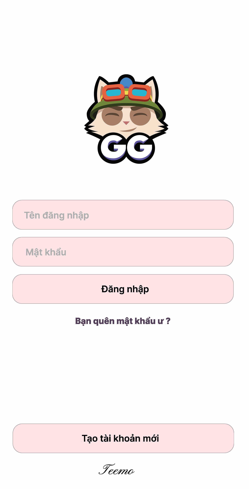
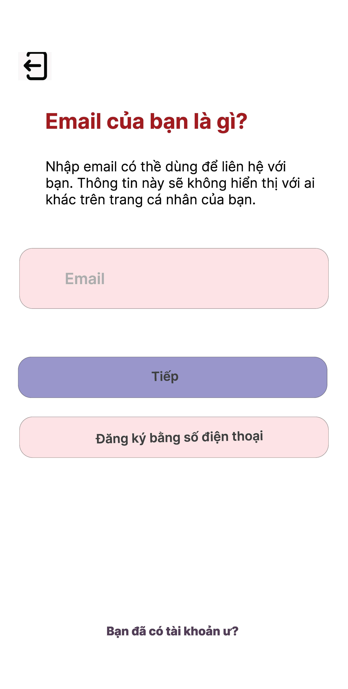
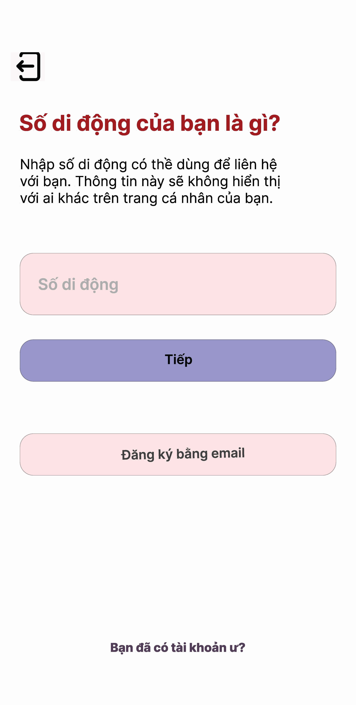

#  MẠNG XÃ HỘI
HO HUY VU MSSV : 201164073
### Built With

## Connect with me:

.

## Features
1. Đăng nhập, Đăng ký, Đăng xuất, Quên mật khẩu (có xác minh email)
2. Đăng nhập nhanh như trên Facebook và Instagram (điều này có nghĩa là ứng dụng ghi nhớ rằng bạn đã đăng nhập).
3. Theo dõi, Hủy theo dõi, Lượt xem hồ sơ.
4. Đăng bài viết ảnh từ máy ảnh hoặc thư viện
    * Thích bài viết
       * Xem tất cả lượt thích trên một bài đăng
    * Bình luận về bài viết
         * Xem tất cả các bình luận trên một bài viết
5. Chỉnh sửa hồ sơ của bạn (tên người dùng, Tiểu sử, liên kết xã hội, Tên).
6. Trò chuyện với bạn bè.
7. Tin nhắn biểu tượng cảm xúc, văn bản.
8. Nhận thông báo.
9. Tìm kiếm người dùng
     * Tìm kiếm dựa trên tên người dùng
10. Đăng câu chuyện từ máy ảnh hoặc thư viện
       * Lượt xem
         * Xem tất cả lượt xem trên một câu chuyện
       * Xóa bỏ
         * Xóa câu chuyện
11. Khả năng ngoại tuyến

## Screenshots
#### Registration | Login
||||

#### Profile | Edit Profile | Account Setting
||||

#### Home | Seen/Unseen Story
||||

#### Comment | Post Photo
|||

#### Mess | Mess
|||

## Module used
* [Cardview](https://developer.android.com/jetpack/androidx/releases/cardview)
* [Retrofit](https://github.com/square/retrofit)
* [Image Croper](https://github.com/ArthurHub/Android-Image-Cropper)
* [StoriesProgressView](https://github.com/shts/StoriesProgressView)
* [Glide](https://github.com/bumptech/glide)
* [Country Code Picker](https://github.com/hbb20/CountryCodePickerProject)
* [Universal image loader](https://github.com/nostra13/Android-Universal-Image-Loader)
* [Circle Image View](https://github.com/hdodenhof/CircleImageView)
